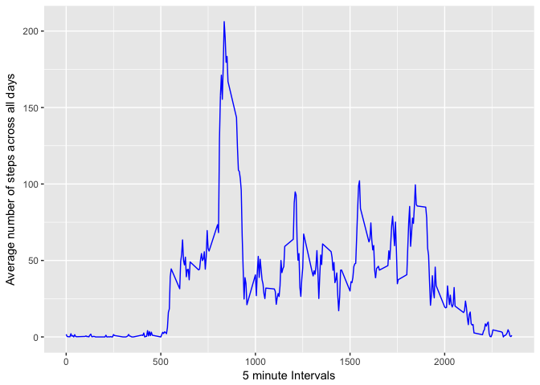
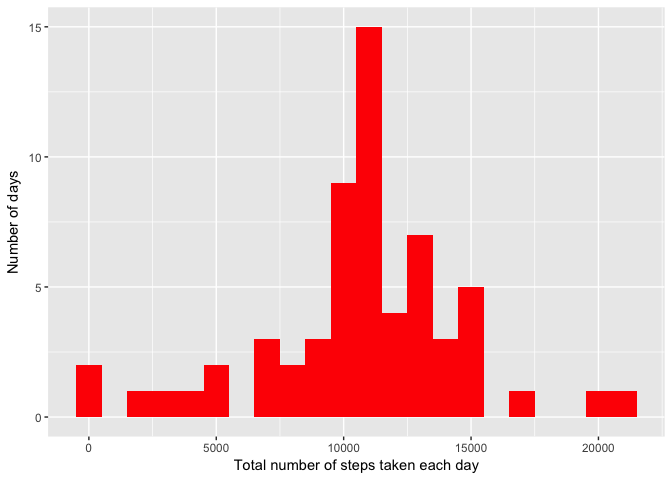
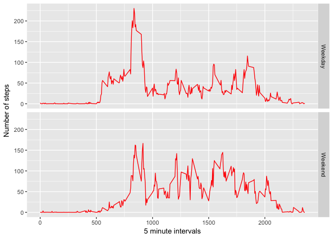

# Reproducible Research: Peer Assessment 1


This Markdown file contains code to run analysis on **activity data**.
Make sure that you have the activity data file in your working directory,
for running R code.

## Loading and preprocessing the data


```r
unzip(zipfile="activity.zip")
activity <- read.csv("./activity.csv")
library(ggplot2)
```

## What is mean total number of steps taken per day?

### Histogram of total number of steps taken per day


```r
totalsteps <- with(activity, tapply(steps, date, sum, na.rm = TRUE))
qplot(totalsteps, binwidth = 1000, fill = I("blue"),
      xlab = "Total number of steps taken each day", ylab = "Number of days")
```

<!-- -->


```r
st.mean <- mean(totalsteps, na.rm = TRUE)
st.median <- median(totalsteps, na.rm = TRUE)
options(digits = 2)
```
The mean is 9354.23 steps and median is 10395 steps.

## What is the average daily activity pattern?


```r
ave.steps <- aggregate(x = list(steps = activity$steps),
                       by = list(interval = activity$interval),
                       FUN = mean, na.rm = TRUE)
ggplot(data = ave.steps, aes(interval,steps)) +
  geom_line(color = "blue") +
  labs(x = "5 minute Intervals",
       y = "Average number of steps across all days")
```

<!-- -->

### 5-minute interval with most number of steps on average


```r
max.st <- ave.steps[which.max(ave.steps$steps), ][1]
```
The 5-minute interval is 835.

## Imputing missing values

### Total number of missing values

```r
miss.value <- is.na(activity$steps)
table(miss.value)
```

```
## miss.value
## FALSE  TRUE 
## 15264  2304
```

### Impute those missing values
Take the average steps taken across 5 minute intervals, and replace
with missing values of steps for 5 minute intervals

```r
imp_act <- activity
imp.values <- function(steps, interval) {
  values <- NA
  if (!is.na(steps))
    values <- c(steps)
  else
    values <- (ave.steps[ave.steps$interval==interval, "steps"])
  return(values)
  }
imp_act$steps <- mapply(imp.values, imp_act$steps, imp_act$interval)
```

### Histogram of the total number of steps taken per day with imputed data


```r
totalsteps <- with(imp_act, tapply(steps, date, sum, na.rm = TRUE))
qplot(totalsteps, binwidth = 1000, fill = I("red"),
      xlab = "Total number of steps taken each day", ylab = "Number of days")
```

<!-- -->

### Mean and Median of total steps from imputed data

```r
st.mean <- mean(totalsteps, na.rm = FALSE)
st.median <- median(totalsteps, na.rm = FALSE)
options(scipen = 999, digits = 2)
```
The new mean is 10766.19, and median is 10766.19. These values are 
higher than previous values as expected. With the replacement of missing(NA)
values both mean and median have increased.

## Are there differences in activity patterns between weekdays and weekends?

From the date variable the days of the week are inferred. Then for days,
Monday to Friday, the value of new column Days in the imputed data is
assigned *Weekday*. Saturday and Sunday are assigned *Weekend*. Then
a two-panel time series graph is plotted to contrast daily activity patterns
on average across 5-minute intervals


```r
imp_act$date <- as.Date(imp_act$date)
imp_act$day <- weekdays(imp_act$date)

which.day <- function(x) {
  weekday <- c("Monday", "Tuesday", "Wednesday", "Thursday", "Friday")
  if (x %in% weekday)
    paste("Weekday")
  else
    paste("Weekend")
}

imp_act$day <- sapply(imp_act$day, which.day)

ave.steps <- aggregate(steps ~ interval + day, imp_act, mean)

ggplot(ave.steps, aes(interval, steps)) + geom_line(color = "red") +
  facet_grid(day ~ .) +
  labs(x = "5 minute intervals", y = "Number of steps")
```

<!-- -->
